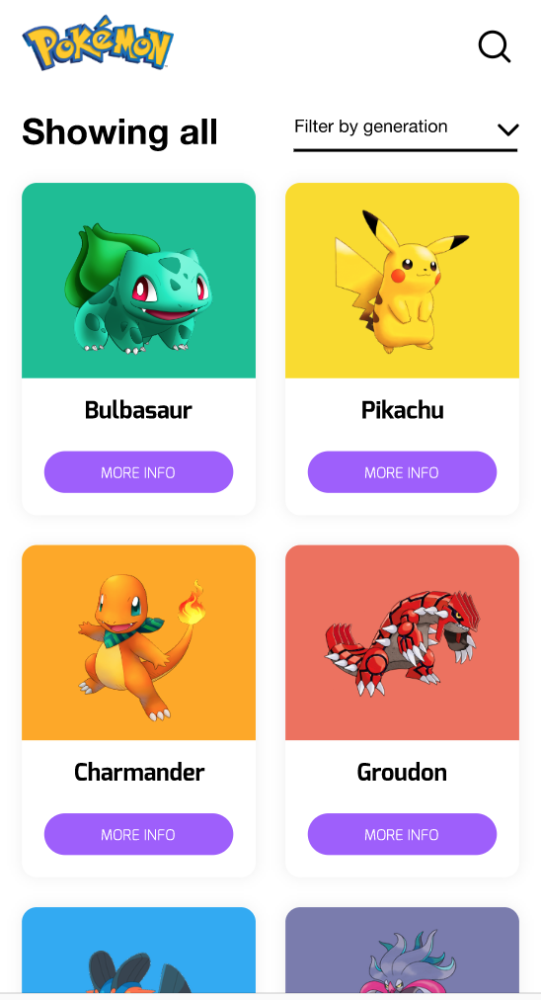

# Desafio Front-end

Este é um pequeno desafio que criamos para testar as suas habilidades, se você chegou até aqui foi porque você o seu perfil foi selecionado, e agora é a hora de mostrar um pouquinho do que você sabe fazer.

Um ponto importante é que você deve criar um fork deste repositório no seu GitHub e usá-lo como ponto de partida, quando terminar o desafio é so mandar um email com o nome do desafio e o seu nome no título.

## Domínio

Nosso domínio é basicamente um pokedex, ou seja, uma lista de pokemons deve ser mostrada contendo a foto e o nome do pokemon.
Quando o pokemon é clicado a tela se expande e informações adicionais são mostradas. Para mais detalhes você pode acessar o link e interagir com o design clicando [aqui](https://xd.adobe.com/view/c2a36f96-c354-4469-4c65-50113b8c8cd0-b492/).

Para obter os dados dos pokemons você deverá utilizar a [POKEAPI](https://pokeapi.co/), que te possibilitará obter todos os dados de que precisa para exibir os pokemons.

## Código

No momento da criação do projeto você é livre para utilizar as bibliotecas que quiser, porém dependendo das tecnologias e frameworks que você escolher o seu projeto será mais bem avaliado.

### Requisitos mínimos

- Design responsivo, sua aplicação deve permanecer minimamente consistente quando redimencionada.
- Ser fiel ao design, sua aplicação precisa seguir o design o máximo possível.
- Mostrar os pokemons através da API, não vale fazer mock dos dados haha.

### Requisitos Bônus

Funcionalidades:

- Filtrar pokemons por geração.
- Scroll infinito na lista de pokemons.
- Animações e efeitos.

Techs:

- Utilizar alguma framework JavaScript, principalmente Vue/Nuxtjs
- SASS
- Typescript

### Dúvidas

Caso tenha alguma dúvida durante o desenvolvimento sinta-se à vontade para me mandar uma mensagem.
